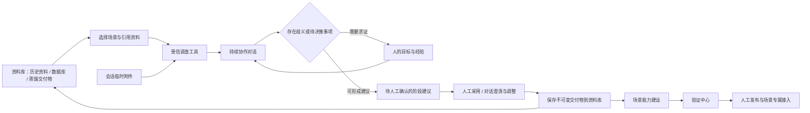

# 业务蒸馏：调查、对话与共识

业务蒸馏解决“这件事为什么值得做、真实过程是什么、依据是否充分”的问题。资料库统一保存调查来源和蒸馏交付物；使用者选择业务场景后，可以从一句想法、一份历史结果或一个具体矛盾开始对话，逐步形成可核对的认知。对话负责推动工作，工具提供可追溯观察，结论页签呈现双方当前达成的理解。

## 平台中的位置

导航顺序为资料库 → 业务蒸馏 → 场景能力 → 验证中心 → 发布与接入。资料库负责长期资料的接入、文件上传和管理，蒸馏页负责按场景协作与对话。蒸馏对话和资料都在建模域，不是正式能力定义或本次调用数据。场景建设继续负责候选治理和能力契约，验证中心检查能力行为，发布与接入负责不可变正式版本和外部权限。

## 交互安排

- **场景确定当前上下文。** 顶栏选择场景，左侧是当前场景的历史对话和“新建对话”。首句创建新的同场景对话；切换场景不会修改已有对话的归属。旧的未归属对话仍可查看并显式复制到场景。
- **对话是主工作区。** 输入框始终易于找到；历史、调查状态和失败恢复都在当前对话中。没有场景时给出选择或创建场景的引导。
- **资料库是长期来源。** 数据库连接、受管文件和正式交付物在资料库统一维护。蒸馏页只选择已有资料及查看引用，不重复提供上传建库和连接数据库入口。
- **临时附件留在会话。** 输入区可以上传仅供当前对话分析的附件，显示上传状态和保留期限；附件不自动创建资料库条目。上传失败保留消息草稿，到期后说明无法继续读取，不冒充已归档资料。
- **问题卡是人工参与点。** AI 对缺少依据、匹配歧义、流程取舍提出少量具体问题，说明询问原因，允许选择与自由回答。发问即结束本轮，不把没有回答当作同意。
- **结论页签与对话并排。** 中间用业务价值、ER、流程、血缘、历史案例、证据和待澄清页签展示产物，右侧持续对话。空页签只有空态；当前版本的 AI 提案先显示为待采用，用户在对话中纠正或采用。系统配置在顶栏“业务系统”抽屉，不占据产物标签。窄屏提供结论/对话切换，页签支持方向键和 Home/End。
- **交接是显式决定。** 保存时引导选择继续、调整或暂缓，每项展示其决定依据，并允许自由补充；没有选择不能提交。每次发布冻结一个版本，之后继续讨论不会改变已经交接的资料。

## 全局设置与 AI 职责

全局设置由侧栏底部齿轮打开，各 tab 直接管理模型、工具、技能与 MCP；原配置链接转入弹窗，保留当前业务上下文。资源按工作区隔离。产物规范及模板附件收拢到资料库。智能业务顾问仅出现在场景详情建模页，负责把明确的业务结论转为能力候选；蒸馏 AI 调查业务问题，验证 Agent 检验正式能力，两者不复用顾问对话状态。

建模顾问实际读取选定受信技能的方法说明及远程 MCP 工具契约目录（tools/list），冻结为独立建模参考并贯穿对话、编译与恢复。方法与接口声明不作为客户业务证据，也不证明工具已经执行。每类最多选择 5 项；不可用、停用或读取期间变更的配置明确拒绝，不能静默忽略用户选择。蒸馏 AI 使用 MCP 的资料读取接口，与该建模参考职责分别处理。

## 工具与技能

本次提供受信静态工具注册：列出调查来源、读取选定资料、读取当前认知、业务价值审查、结果逆向审查、流程价值审查、读取允许的目标页面、请求人工澄清和提出认知建议。用户可在对话设置中选择调查工具，人工澄清与阶段建议始终保留。模型选择何时调用；服务端负责参数、来源、权限、预算及返回值验证。受信技能通过实际读取本地方法说明参与分析，不执行脚本；MCP 使用远程只读 resources 协议，按本轮选择及连接器版本查找、读取文本资料，不使用 tools/call。所选资源、读取回执和依据参与后续澄清与交付物追溯。响应在协议解析前设累计字节和 SSE 事件上限，压缩响应不予接受。扩充调查引擎应增加有界适配器、封闭契约和行为测试，不接受租户文本作为可执行代码。

工具步骤展示实际调用状态、结果摘要、来源和限制，不展示模型隐藏推理。数据库工具通过返回的表/字段引用读取有限行样本，并对实际样本执行精确单键/复合键匹配；样本结果不证明总体唯一性。浏览器工具打开已授权系统，执行页面脚本，注入加密登录凭据，点击导航、填写筛选条件并读取可见结果。请求经固定 DNS 的受控传输，同源/路径/授权限制和每请求复核在服务端执行。登录/只读查询以外的 POST 拒绝，重定向需要显式导航；验证码和多域 SSO 通过对话与专家协调。详见 README 的启用配置。

证据区分输入、知识、历史结果、过程和参考。断言区分事实、推断、假设和冲突；模型产生的新结论不能直接变成事实。网页观察由服务端保存来源、正文摘要、哈希、时间和读取限制，模型不能伪造已经执行的读取回执。

## 持久状态与人工权威

对话发送先落库并返回受理结果。幂等标识防止重复发送；每个项目同一时间只运行一轮调查。worker 使用数据库 claim、lease、续租和代际 fencing，浏览器断开不会成为执行权威。取消和恢复保持已有成果，过期执行者不能覆盖新状态。

浏览器会话和控件引用仅属于当前 worker claim；它们不作为持久权威。登录中断结果未知时停止，不自动重试。每轮绑定项目 revision、调查来源身份和发起人。工具调用、终态写入和人工采用重新核对这些条件；资料、权限或项目变化后拒绝陈旧结果。人工澄清、采用和发布分别是可观察的动作，AI 回答不能证明这些动作已经完成。

## 输出与下一阶段

交接包含业务说明、现状流程、目标流程、ER 图、数据血缘、历史案例、结构化业务契约候选及证据来源清单。场景顾问读取文件用途、业务范围和未决问题，继续既有的能力候选建设流程。共享认知项目须明确复制或绑定到目标场景后交接，避免无关项目影响场景判断。

外部集成密钥绑定单个业务场景；REST v2 和 Capability MCP 使用相同权限边界。认知资料发布与能力正式发布是不同动作，二者都不扩大密钥的场景权限。
