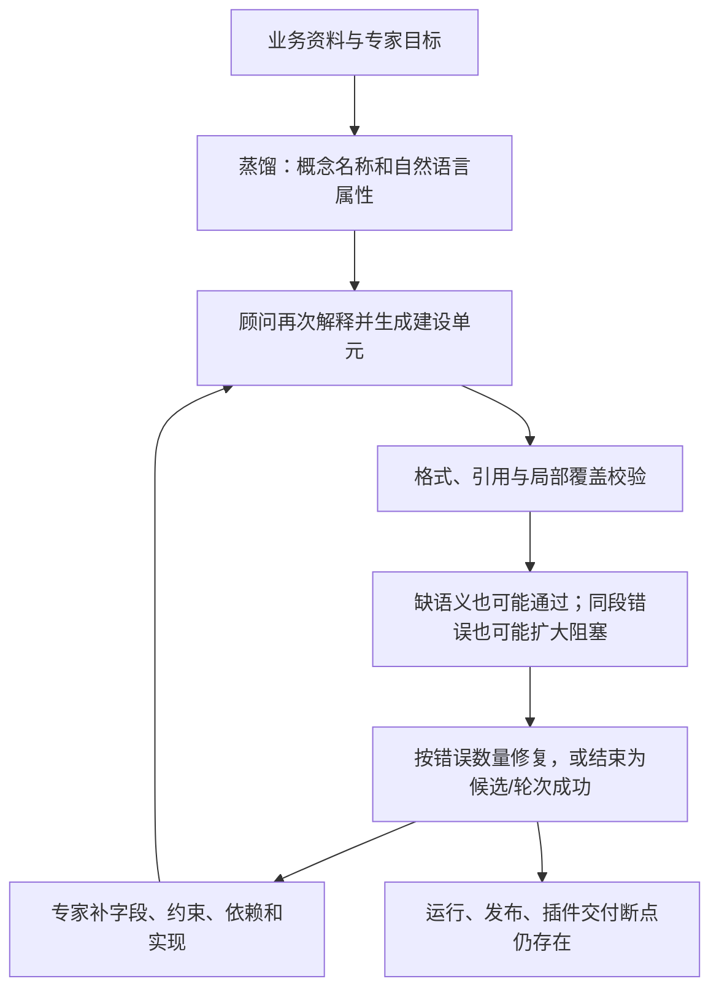
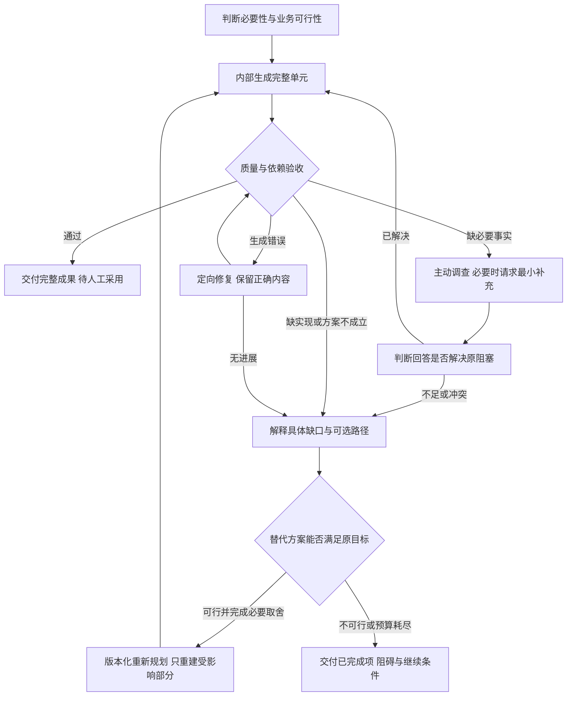

# 业务场景能力工厂：代码解剖与改造方案

日期：2026-10-03（Asia/Shanghai）

最新需求澄清与方案修订：2026-10-04（Asia/Shanghai）；第三轮证据与交付契约见第 19–22 节。

检查基线：Git `8b85487e40dbdd68ce63ea3040098fb9454325fa`；关键源文件 SHA-256 见诊断结果。
性质：本轮诊断与设计建议，不是已批准的功能规格，也不代表改造已经实现。

## 1. 结论与证据边界

当前最有证据支持的病因有两组：**上游 AI 成果缺少足够的结构化业务信息与单元完成判定，错误归属和修复评价还会扩大阻塞或接受内容退步；下游建设契约、可执行实现、工作流组合、正式发布和外部交付之间仍有具体断点。业务目标缺少贯穿这些阶段的可执行验收对象。**

因此，继续增加页面、补提示词、让模型反复修复 JSON，不能补上尚不存在的运行能力。插件适合作为面向 Agent 用户的交付单位；同时需要补齐工厂内部从业务需求到受治理实现的生产链。

用户补充的“生成 10 个对象至少 7 个完整可用”已纳入第二轮诊断。2026-10-04 进一步澄清：顾问应先内部修复、交付成立且完整的单元，阻碍必须可解释、可补充、可重新判定；无法收敛时要切换方案或明确停止。70% 是生成质量指标，不能成为交付剩余半成品的许可。新证据与方案见第 13–22 节；其中“候选”是治理身份，“完整可用”是质量与运行状态，必须分别验收，不能通过改名称或自动晋级制造合格率。

本报告不以 README、工作记录、注释、DONE 标签或测试数量证明业务完成。旧文档仅用于定位线索，下面的核心判断重新检查了当前实现，并使用独立的合成输入复现。未读取或输出 `backend/.env`，未访问、修改真实业务数据，也未调用真实外部服务。

证据分为三类：

- **A：已复现**。Python 3.12 直接调用当前服务边界，以合成输入观察结果；不是 HTTP、浏览器或真实数据库端到端验收。
- **B：静态证据**。当前入口、调用方、实现、DTO 或前端消费者直接显示该行为。
- **C：诊断推断/待验证**。对反复卡住的系统性解释、产品效果和目标架构，仍需真实场景检验。

可重跑程序：[audit_scenario_delivery.py](../backend/scripts/audit_scenario_delivery.py)。本次输出及代码内容身份：[诊断结果 JSON](./scenario-delivery-audit-results-2026-10-03.json)。脚本不创建数据库会话、不启动应用、不执行 LLM/网络调用；其成功退出表示观察完成，不能解释成场景已可交付。

## 2. 本轮需求账本与影响图

| ID | 原文目标 | 非目标 | 可观察验收 | 影响层/文件 | 保持不变项 | 证据 |
| --- | --- | --- | --- | --- | --- | --- |
| D1 | 查明场景建设为何始终差最后一公里 | 按历史文档宣布完成；本轮直接重写平台 | 给出建设→执行→发布断点及可重跑复现 | 场景 UI、编译器、Provider、工作流、发布；诊断脚本/报告 | 用户改动、已发布语义、现有业务记录 | A/B 证据与当前回归 |
| D2 | 判断插件是否适合作为外部能力交付 | 用换协议替代业务闭环；假设所有宿主插件通用 | 明确交付对象、运行位置、安装/升级/确认/回执链路 | 外部协议、SDK、交付包与宿主适配方案 | 统一 Invoker、租户、ACL、版本、审计 | 代码调用图、官方协议/插件资料 |
| D3 | 为能力定制引入 Coding | 在生产动态执行租户/LLM 任意代码 | 区分实现生成与封装生成，明确构建/评审/注册门禁 | 受信 Provider、构建任务、测试与产物设计 | 精确静态注册、运行隔离、密钥边界 | 目标职责与拒绝路径 |
| D4 | 给出最优治疗方案 | 大重写、顺手修旁支、未经批准部署 | 提供分期、最小纵向闭环、退出条件和风险 | 本报告；未来实现范围分别列出 | 旧发布快照、兼容窗口、人工发布 | 分期验收矩阵 |
| D5 | 一切文档都应受到怀疑 | 把文档当作事实权威 | 核心判断具有独立代码/探针依据，明确未验证项 | 当前源码与合成探针 | 不扩大到真实客户数据操作 | 分级证据与验证记录 |
| D6 | 继续解剖业务蒸馏 AI 与智能业务顾问的半成品问题 | 将候选身份等同低质量；未经验证归因于模型型号 | 独立观察稀疏成果、交接信息、校验、错误归属与修复终止；保留正向对照 | distillation Schema/工具/worker、compiler/quality/候选；新增诊断与报告 | 人工决策、候选治理、可信来源与现有生产代码 | 新合成探针及源码内容身份 |
| D7 | 一次生成 10 个对象至少 7 个完整可用 | 通过少生成、虚构字段或降低门禁凑比例 | 固定需求清单；定义单元完整率、首轮合格率、修复后合格率与业务闭环；关键依赖全部通过 | 本报告的质量契约与实施验收 | 不自动晋级/发布，不要求无资料时猜测 | 质量矩阵、反作弊口径与实施退出条件 |
| D8 | 顾问交付成立且完整的对象；缺信息明确告知，人工补充后判断能否解决，必要时切换方案 | 将 70% 当作向用户交付 30% 半成品的许可；无尽重复生成；本轮直接改生产行为 | 内部失败不计交付；每项阻塞有补充条件、判定和退出；修复与重新规划分开；完整结果及明确缺口可审阅 | 决策 gate、repair、checkpoint/staging/场景消费者；新增闭环诊断与报告 | 已核实业务要求、正确成果、人工决策、权限及不可变发布 | 服务边界探针与状态/验收契约 |

本轮影响图：

```text
业务目标
  → 场景建设/顾问入口
  → 场景模型编译与候选治理
  → 输入端口/映射/函数/规则/Action/Workflow
  → Provider + CapabilityInvoker + worker
  → 验证中心 + 不可变 Release
  → REST/MCP/SDK + 用户安装的交付包
  → 业务产物/外部执行回执 + 可执行验收
  → 诊断脚本/结果/报告
```

补充影响图：蒸馏对话/资料读取 → 蒸馏 DTO/提案 → 结构化交接 → 顾问编译/单元校验 → 错误归属/有限修复 → 候选治理 → 既有执行/发布/插件链。新增范围仍只包括诊断、结果与方案，不修改上述生产层。未来建议并不自动授权修改宪法或部署。

## 3. 六个具体断点

### F1：建模完成不等于实现完成（A）

合成需求：“计算两个日期之间的精确天数”。编译器接受带封闭输入/输出 Schema 的 `runtime_kind=contract` 函数：

```text
compiled_functions = 1
blocking_issues = []
coverage_status = modeled
capability_readiness.executable = false
```

依据：[scenario_model_compiler.py](../backend/app/services/scenario_model_compiler.py)，函数标准化与 `_validate_coverage`；[capability_readiness_service.py](../backend/app/services/capability_readiness_service.py)，`_function_readiness`。

这不是“所有契约草稿都应该被禁止”的结论。保存未实现的业务契约是合理的；缺口是后续没有把“已描述但缺实现”变成有负责人、有依赖、有可观察退出条件的实现任务。段落覆盖证明来源被处理，不能证明业务输出已能生成。

日期差这一运行类型被 `normalize_definition` 拒绝；内置数值函数只有 weighted_score、threshold、geo_distance、timeseries_aggregate，另有精确注册的 Provider 扩展入口。结论限于当前内置能力，不意味着日期差不可通过新受信 Provider 实现。

### F2：函数和工作流之间缺组合桥（A+B）

`start → function → end` 的最小图被当前 `validate_workflow_graph` 拒绝：`工作流包含不支持的节点类型: function`。

依据：[policies.py](../backend/app/services/policies.py):82；[workflow_service.py](../backend/app/services/workflow_service.py)，`_execute_dag`；[WorkflowEditor.vue](../frontend/src/components/workflow/WorkflowEditor.vue):71；[capability_readiness_service.py](../backend/app/services/capability_readiness_service.py)，`_workflow_references`。

后端允许的节点集合、编辑器、执行器与 readiness 都缺少函数调用这一闭环。现有 DAG 的 Action/Rule 分支直接调用工作流服务中的执行方法；没有通用的受治理能力调用节点。不能通过让 LLM 节点“自行计算”来证明精确函数已被编排，也不能以额外 HTTP 自调用替代统一内核。

### F3：工作流入口拒绝本次受管输入（A+B）

给 `OntologyWorkflowProvider` 一个合法的合成 `ResolvedDataHandle(dataset_version)`，数据边界直接拒绝：`built-in workflow provider does not support managed runtime inputs`。

依据：[builtin_capability_providers.py](../backend/app/services/builtin_capability_providers.py):266、`OntologyWorkflowProvider.preview/invoke`；[workflow_authoring_data.py](../backend/app/services/workflow_authoring_data.py)，执行字段和作者指引。

语义查询 Provider 可以处理受管数据，与通用工作流 Provider 不能传递这些输入，是两个不同范围。将两者都建好不会自动产生连接。该拒绝本身保护了未实现的材料化边界，不能简单删掉检查；需要明确父端口→子端口映射、固定 DatasetVersion、原 principal/Release 与持久执行 lineage。

### F4：Provider 规则契约和建设契约不一致（A+B）

同一个合成 `semantic-audit/v1`、manual 模式规则：

```text
semantic_audit.normalize_spec accepts = true
scenario_model_compiler.normalize_rule_condition accepts = false
reason = 规则包含不支持的运算符：空值
```

依据：[semantic_audit.py](../backend/app/providers/semantic_audit.py):92；[scenario_model_compiler.py](../backend/app/services/scenario_model_compiler.py):5334，规则编译段；前端规则编辑使用 `RuleConditionBuilder`。

通用记录条件和 Provider 的版本化业务评估规范不是同一个语言。当前作者链路不能直接产出这个 Provider 可消费的规则。不能在通用编译器中硬编码该行业语义；应通过受信 Provider 作者契约提供封闭、可版本化的候选结构与确定性验证，再由通用编译器装配。

### F5：建设与正式发布的执行器范围不一致（A+B）

当前 UI 提供 SQL、template、skill、mcp、http。对启用的合成 Action，正式发布边界拒绝 template、skill、http、script。

依据：[ScenarioDetail.vue](../frontend/src/views/ScenarioDetail.vue):1147；[release_service.py](../backend/app/services/release_service.py):2137，`_assert_publishable_runtime_bindings`；[scenario_release_service.py](../backend/app/services/scenario_release_service.py)，创建发布必经该门禁。

复现证明发布边界的拒绝，并未实际执行这些 Action 或创建正式发布。静态调用图显示这些是建设端存在的执行器类型。结果是某些建设路线到交付阶段必须转换实现。它尤其影响“按模板生成文件”等最终产物能力。

门禁的便携性/密钥理由应保留。治疗方式是提供可冻结、受治理、具有版本和逻辑绑定的产物/连接器实现，并在建设规划时标明“正式可交付、仅验证可用、缺实现桥”。不能为了过发布直接开放旧脚本、真实路径或任意 header。

### F6：结构正确性的证据不足以证明业务目标完成（A+B）

保留同一个合成本体对象，删掉 gold 中的函数和工作流，当前结构评测 `micro_f1` 仍为 1.0。评测类别是 object/property/relation/constraint/rule。

依据：[scenario_model_evaluator.py](../backend/app/services/scenario_model_evaluator.py):19、229。实现自身明确返回 `evaluation_scope=structural_contract`、`business_meaning_verified=false`；这个评测器没有冒充业务验收，应继续保留其准确边界。

缺口在于尚未形成接到正式发布和交付包的业务验收闭环。蒸馏有 `desired_outcome`、自由文本 `success_metric` 和历史案例摘要；编译 coverage 对来源段落负责；readiness 对运行前提负责；发布 DTO/创建路径对快照与依赖负责。检查到的这些消费者没有形成统一的“需求 ID→实际调用输入→结果断言/拒绝路径→产物→版本证据”对象。此结论是受检查范围约束的 B/C 证据，不是对仓库任何隐藏功能不存在的数学证明。

## 4. 从局部断点到系统病因

| 系统判断（C） | 当前证据 | 对“最后一公里”的解释 | 治疗方向 |
| --- | --- | --- | --- |
| 描述能力与生产能力没有持续对账 | F1、F6 | 图和契约越来越全，却没有人/任务负责未实现的结果 | 以可执行业务验收及实现缺口为建设主线 |
| 原子能力存在，但运行组合不闭合 | F2、F3、F4 | 单项成功无法推出整个场景成功 | 显式类型连接、受管输入传播、Provider 作者契约 |
| 到发布时才发现实现不便携 | F5 | 验证成功之后仍需重新选执行路线 | 在规划阶段检查正式交付能力矩阵 |
| 外部交付仍以协议资源为中心 | 当前接入 Manifest/SDK/页面 | 接入方还需理解目录、参数、输入映射、业务方法和异步交互 | 用安装包交付方法、工具和接入体验 |
| 编译/顾问/页面耦合放大修补成本 | 巨型模块及跨层消费者 | 一个字段要穿过生成、修复、候选、编辑、发布和运行多处 | 按契约边界逐段抽离，不做全页重写 |

当前源码行数包含空行：编译器 9,820，assistant router 10,571，workflow service 3,060，ScenarioDetail 5,875，GlobalAssistant 3,629。行数不是因果证明；但消费者跨这些模块，是建设链每增加一种能力都要做多处一致性修补的可验证风险。

前端有十二个资源页签，这证明当前导航是资源分类，**不证明服务端强制用户走完十二步**。建议把资源页签保留为专家工具，日常建设围绕“要交付什么、还缺什么、哪些案例已通过”组织。零数据能力不应被迫建数据集或映射；只有需求消耗对象数据时才建设对应语义映射。

## 5. 插件的正确位置

插件、Skill、工具、MCP、REST 解决不同层的问题。将它们视为互斥技术，会把分发问题和执行问题混在一起。

| 形式 | 主要价值 | 单独使用的不足 | 建议位置 |
| --- | --- | --- | --- |
| 插件 | 一次安装业务方法、工具入口、模板及配置；版本化分发 | 不自动补齐计算、数据、权限或后台任务；依赖宿主 | Agent 用户的主要交付物 |
| Skill | 告诉 Agent 何时使用、如何收集输入、如何解释结果 | 自然语言指令不能保证确定性运算和副作用成功 | 插件中的业务操作方法 |
| 工具/MCP | 可发现、类型化调用，适配 Agent 宿主 | 不完整表达业务实施方法、安装与业务验收 | 插件的工具适配器 |
| REST/SDK | 应用、调度、后端和非 Agent 客户端集成 | 裸接口要求接入方自己完成体验与编排 | 统一运行内核的程序接口 |
| 受信 Provider | 精确执行领域算法、规则、数据处理 | 自身没有安装/对话/最终文件交付体验 | 场景实现与服务器运行扩展 |

Claude Code 官方将插件描述为技能、Agent、hooks、MCP 等组件的安装单位，并说明不同运行表面加载的组件可能不同：[插件概览](https://code.claude.com/docs/en/plugins)、[Manifest 参考](https://code.claude.com/docs/en/plugins-reference)。Agent Skills 格式允许说明及 scripts/references/assets：[官方规格](https://agentskills.io/specification)。MCP 规定工具/资源等交互与传输，并支持本地与远程服务：[官方架构](https://modelcontextprotocol.io/docs/learn/architecture)。这些资料用于核对生态边界，不证明本仓库支持其全部功能。

建议结论：**采用插件作为 Agent 场景的产品交付单位，保留 MCP/REST/SDK 作为受治理执行通道。**当前 Agent、REST、MCP 都走 `capability_application_service.invoke → CapabilityInvoker`，这是值得沿用的真实代码基础。没有证据表明 REST 是造成 F1–F6 的原因。

插件可以让业务方法、文件工具和用户工作区交互更自然，但并非自动获得额外权限。官方宿主仍有安装、代码执行、工具与企业策略边界。第一期选一个明确宿主实测；不要宣称一个原生插件包可直接安装到所有第三方应用。

## 6. 目标生产链与需要增加的契约


以下名称是候选设计名称，尚非已发布协议 token。可先用小型 DTO/记录与现有快照、任务和产物机制承载，避免一次引入全新复杂元模型。

| 契约 | 必须回答的问题 | 关键边界 |
| --- | --- | --- |
| 业务交付契约 | 谁使用、给什么输入、产出什么、何时算完成、谁验收 | 每项需求有稳定 ID；来源与运行数据分离 |
| 可执行实现计划 | 每项结果由哪个入口/依赖/Provider/节点实现，缺什么 | 缺业务事实、缺配置、缺实现、缺组合、缺发布桥、缺宿主能力分别报告 |
| 验收案例集 | 当前输入应得到什么结构、值、状态、证据或拒绝 | 合成/受管样本；确定性断言；LLM 结果另设专家量表及预算 |
| 验证记录 | 哪个定义、实现构件和案例版本实际被执行 | definition hash、Provider 精确版本/构件内容身份、案例版本、回执、结果；变更使记录陈旧 |
| 插件构建规格 | 发布哪些业务入口、哪些宿主能力、本地/服务端如何分工 | 导出最小依赖闭包，不把整个场景所有草稿暴露出去 |
| 安装绑定 | 谁在什么工作区安装、授权哪一场景、使用哪一发布 | 安装与授权分离；包内没有真实凭据；服务端再次检查权限 |

BusinessRequirement 不等于业务对象类型，PluginArtifact 不等于 Invocation。三层身份继续成立：换输入不改变 Definition；插件构件有自己的内容摘要与宿主兼容信息；本次文件和数据只进入调用身份。客户端报告的包 hash 不能替代服务端认证，也不能证明用户没有修改本地代码。

验证记录用于展示是否覆盖需求及发布前阻塞原因，不自动创建/启用 Release，不用评分替代人工决定。建议只对选定的交付入口及依赖闭包检查，避免无关草稿阻塞已完整的小能力。

## 7. Coding 应负责两种不同工作

### 7.1 缺失能力实现

当现有受信能力不能表达日期计算、特定算法或领域处理时，创建明确实现任务：冻结输入/输出/边界/黄金案例→在隔离 workspace 生成源码候选→执行实现与拒绝路径测试→评审→作为精确版本受信 Provider 纳入构建→重新验证受影响能力。

AI 生成的 Python、脚本或包不能直接成为数据库记录指定的可执行路径。现有静态注册是生产执行边界，不能因“插件更灵活”绕过。第一期允许受控 Coding 产出源码和测试、形成可审查变更；实现正式上线走受信构建和部署。若未来要求用户无审核上传代码并运行，必须先由用户明确决定宪法/架构变化，另建隔离执行域。

### 7.2 已验证能力封装

已存在能力的 SDK 调用、工具描述、Schema、版本 pin、目录和说明优先由确定性模板生成。Coding 处理新的宿主适配、文件呈现或集成代码，不能重新抄写平台的规则、权限、readiness、幂等和确认逻辑。

推荐分工：

- 业务专家确认目标、例外与验收；模型输出是候选。
- 建模流程产出语义和封闭契约；实现规划器识别运行缺口。
- Coding 构建实现候选/宿主适配；正式注册与部署仍是受信工程流程。
- 包构建器从冻结 Release、受信模板和宿主规格生成可审查工件。
- 外部宿主负责对话与工作区文件体验，服务器负责业务事实、权限和执行。

## 8. 首期插件范围与运行分工

**推荐先采用在线插件；业务计算由平台执行，插件提供业务方法、输入收集、工具入口及本地结果呈现。**这与当前统一内核成本最匹配，能够复用发布停用、场景专属密钥、幂等、审批和回执。

| 运行方式 | 适用情况 | 额外成本 | 建议 |
| --- | --- | --- | --- |
| 在线插件 | 多租户治理、数据查询、权限变化、异步工作流 | 平台可用性、受管上传与延迟 | 第一期 |
| 本地呈现 + 在线业务计算 | 需要用户工作区的 Word/Excel/图表 | 宿主文件权限、保存回执、格式兼容 | 首期按真实需求纳入 |
| 私有部署运行时 + 插件 | 客户要求数据留在自有基础设施 | 部署、迁移、运行角色、升级和支持 | 作为后续同内核部署产品 |
| 完全独立离线执行包 | 必須脱离服务端且能力可封闭 | 权限/发布撤销、运行状态、审计、依赖与一致性重新设计 | 单独立项，不能由本轮直接承诺 |

本地文件操作也会改变用户工作区状态。插件必须使用宿主受信文件工具和明确保存位置；需要确认的操作按宿主与能力契约执行。平台计算成功、产物内容生成、文件实际保存、文件发送是不同状态，不把一句“已生成”当作落盘/发送证明。

候选规范包结构（概念结构，非任何宿主的原生 Manifest）：

```text
scenario-package/
  package-manifest.json        # 包版本、入口、运行方式、兼容宿主
  release-lock.json            # Release/Definition/Provider 精确 pin
  skills/<entrypoint>/SKILL.md # 方法、输入缺口、状态解释、例外
  schemas/                    # 经授权导出的业务 Schema
  adapters/<host>/            # 该宿主实际支持的插件清单与工具封装
  templates/                  # 可分发的输出模板
  tests/                      # 合成业务案例及宿主安装验收
  dependency-lock/            # 构建/运行依赖锁定信息
  provenance/                 # 源码、构件、验证记录身份及签名
```

服务器端 Release、tenant、principal 与权限始终权威。包内可带稳定业务入口和内容摘要，不带真实 API key、客户文件、物理 SQL/表列、连接 URL 或 MinIO 坐标。实现源码、规则依据和模板是否可分发也需业务所有者授权。

完整交付流程必须包括：

1. 选择人工启用的 Release 和交付入口；校验依赖、验证记录及宿主需求。
2. 构建候选插件、校验输出内容和依赖；生成真实宿主 Manifest。
3. 在干净宿主安装并执行同一案例；确认工具发现、Schema、上传、异步状态和产物交付。
4. 人工发布包版本；下载/安装后独立完成场景授权，真实密钥通过受信配置注入。
5. 调用固定 Release；停用或撤销凭据仍由服务端生效，不回退草稿/最新版。
6. 升级先展示兼容性与权限变化；明确选择新版本，再跑既有案例；保留旧包身份和可审计回退路线。旧 Release 已停用时，回退也不能绕过停用。

构建含 LLM、下载或子进程 I/O 时，使用持久任务/lease/fencing。PostgreSQL 保存构建与包版本权威，MinIO 保存不可变产物，双写沿用 intent/outbox。构建状态与业务调用状态分离；服务端不得依据客户端构建成功文案推进发布。

## 9. 治疗顺序与退出条件

### P0：把完成对象改成一个可交付业务结果

选一个业务专家熟悉的真实场景及有限范围，先固定输入、最终产物、判断逻辑与关键例外。采集正常案例、边界案例、缺数据/缺证据、权限拒绝和取消/重试案例。真实数据只进入授权受管验收环境；仓库测试用合成样本。

退出条件：每个目标都有实际结果断言或明确人工验收量表；建设计划能说清已有能力和缺口；不以“对象数/候选数/图完整/回答很长”验收。没有用户补充具体案例时，本报告不能替代专家给出黄金业务结果。

### P0.1：让 AI 先交付可验收的建设单元

补齐结构化建设交接、固定需求单元清单、按单元的质量判定和错误归属，以及不丢已知内容的定向修复。探索草稿可以不完整；标为可交接/可采用的成果必须达到本次阶段的完成条件。不能一边修运行内核，一边继续把名称清单交给专家补全。

退出条件：先用同一个专家确认的 10 单元案例验证首轮至少 7 个完整、无需人工补字段即可采用；修复过程保留正确属性、约束与依赖；共享来源只阻塞真正受影响的单元；信息不足与实现缺失各自形成可行动缺口。随后扩大到第 16 节的质量基准。这个条件尚未通过真实模型测量。

### P1：补运行组合与输入传播，完成一次纵向执行

最小范围先支持工作流调用已有函数，并通过明确 port 处理本次受管数据。使用独立节点 executor/协议无关调用 port，组合根装配 Invoker，避免 workflow→invoker→Provider→workflow 的循环依赖扩张。

子调用必须继承原 Actor、tenant、冻结定义/Release、correlation 和数据版本，记录 parent invocation；派生幂等键绑定父运行、节点和恢复 lineage。大数据传受管逻辑引用和有界结果，不把整份文件、所有行或任意 SQL 填进节点上下文/LLM。

退出条件：同一输入版本完成查询/计算/规则/输出链；输入 A/B 保持 Definition 一致；双 worker、暂停恢复、重试、迟到响应和权限失效正确。副作用确认采用明确的复合预演/确认或逐项策略，不能让新增节点默认 `confirm=True`。

### P2：补必需实现与发布桥，并给建设端真实能力矩阵

只新增首个场景必需的受信计算/规则/产物实现。Provider 作者 Schema 与运行 Schema 从同一精确身份获得。建设前返回类型化缺口，区分业务待澄清与工程缺能力；修复 JSON 不可能增加的能力，应转为实现任务。

退出条件：模板/连接/规则等选定路线在冻结 Release 中可执行；建模验证与正式调用对同一契约得出一致业务结果；输出内容与文件保存/发送状态各有回执。

### P3：先完成一个宿主的插件安装闭环

用确定性包构建器封装已验收入口；为明确宿主生成 Skill、工具与配置适配。避免先建商城、泛化所有宿主或加入大量 hooks。

退出条件：外部用户在干净环境安装并授权后，使用新的本次输入完成同一业务目标；过程无需懂内部资源 ID/映射 JSON；确认、审批、失败、断线恢复、取消与产物保存均可解释；停用/撤销后拒绝新调用。

### P4：规模化工厂与 Coding 构建任务

在一个场景真闭环之后，加入实现候选构建、包版本、升级/回退、依赖锁与签名、受控分发、多宿主适配，以及单位场景成本/成功率/人工修复次数指标。以第二个不同场景和零数据场景验证通用性。

退出条件：新增场景主要新增治理定义/配置或受信实现工件，而不是修改通用 prompt/router/执行器中的行业分支；同一案例从不同渠道获得一致结构化结果及安全状态。

## 10. 实施门禁、兼容与验收矩阵

各期是可独立评审的纵向改动。旧 Release 不重写；新增节点/Provider/包格式带显式版本，旧 Provider 版本不得偷偷换义。新增持久字段使用 Alembic single head，同步运行 schema revision，并用隔离真实 PostgreSQL 验证；runtime 角色不做 DDL。

| 验收维度 | 必须观察到的结果 |
| --- | --- |
| 业务完成 | 结果字段/值/证据与案例一致；未实现资源不能计入已交付需求 |
| 定义与数据分离 | A/B 数据改变调用指纹，不重建业务定义；零数据能力不强迫映射 |
| 组合 | 子能力带同一冻结定义、Actor 和输入版本；不绕统一执行；拒绝非法端口连接 |
| 规则作者一致性 | Provider 接受的作者契约可经候选治理保存、发布并调用；错版本拒绝 |
| 产物 | 结构化结果保留；实际保存/发送依赖受信回执；失败不报完成 |
| 租户/权限 | 跨场景/租户拒绝；成员失效、发布停用、密钥撤销及时拒绝新调用 |
| 副作用/并发 | preview/confirmation 绑定实际复合计划；重复、崩溃和未知结果不盲重放 |
| 宿主 | 干净安装、工具发现、权限配置、输入收集、窄屏/键盘与业务文件交付 |
| 版本 | 新包升级明确；不回退草稿；旧快照与回执可追溯；不兼容变更拒绝 |
| 工厂通用性 | 第二个不同业务场景及零数据反例通过；无行业硬编码进入通用内核 |

## 11. 本轮实际验证

环境实查：默认 Python 为 3.13.5，不用于后端验收。使用 `D:/anaconda3/envs/ontology_platform_env/python.exe`，Python 3.12.0。Node v24.6.0，npm 11.5.1。`frontend/package.json` 未声明顶层 engines；本次测试能运行不等于补齐了版本支持声明。

项目 3.12 环境初始没有 pytest；为本次回归将 pytest 8.4.2 和测试依赖安装到仓库内忽略的 `.tmp-scenario-audit-testdeps`，未修改 requirements、lockfile 或全局环境。初次安装未取得包；使用官方 PyPI 的隔离 pip 调用成功。

| 命令/验证 | 当前结果 | 含义与限制 |
| --- | --- | --- |
| Python 3.12 执行 `backend/scripts/audit_scenario_delivery.py` | 完成；六类观察及阈值正向对照，结果包含源码 SHA-256 | 复现服务边界断点；非真实业务验收 |
| `python -m pytest backend/tests -q -p no:cacheprovider --tb=short --basetemp <仓库内新建隔离路径>` | **242 passed**，3.95 秒 | 现有回归全部通过，F1–F6 仍可复现；未启用 PG 集成开关 |
| `npm --prefix ./frontend test` | **229 passed** | 第一次沙箱内 spawn EPERM；同一命令经自动审核在沙箱外重跑通过 |
| `git diff --check` 与文档引用/源码 hash 检查 | 见本轮最终复查 | 验证报告、诊断脚本与基线一致 |

后端首次回归为 237 passed、5 个 tmp_path setup errors，原因是既有系统 pytest 临时目录拒绝访问；未改断言/跳过用例，改为仓库内新建且 containment 已验证的隔离路径后，全部 242 项通过。

可复现的 PowerShell 核心命令（仓库根目录；3.12 环境及 pytest 8.x 已具备时）：

```powershell
$env:PYTHONDONTWRITEBYTECODE='1'
python .\backend\scripts\audit_scenario_delivery.py
$env:PYTHONPATH=(Resolve-Path .\backend).Path
python -m pytest .\backend\tests -q -p no:cacheprovider
npm --prefix .\frontend test
git diff --check
```

若使用本轮临时测试依赖，追加其目录到 PYTHONPATH，并设置 `PYTEST_DISABLE_PLUGIN_AUTOLOAD=1`。不要复用未知/已有的 `--basetemp` 目录，因为 pytest 会清理该目录；使用仓库内已验证的全新路径。

未运行：前端 build、真实 PostgreSQL/MinIO/Redis 验收、迁移往返、真实 LLM/客户场景、真实浏览器和外部插件安装。理由：本轮新增诊断与方案，未改生产 UI、执行契约或数据库；这些验证是上述治疗阶段的退出条件，不能由合成探针或绿灯回归代替。未将历史工作记录中的验收作为本轮通过项。

## 12. 应立即执行的工程决策

先让一个需求获得完整业务结果，并能在冻结发布上复现，再交付一个真正可安装的宿主插件。并行增加零散资源不会消除已复现的组合与发布断点。

保留行业无关的本体与统一执行内核；把“缺实现”提升为显式工厂任务；把业务案例变成贯穿建设、验证、发布和插件安装的共同验收；把受控 Coding 放在实现与构建阶段；把插件作为用户拿到的业务产品。

本轮尚缺一个由业务专家确认的具体场景及黄金结果。它影响 P0 的业务验收内容，不影响已经复现的工程断点与上述分层判断。

## 13. 补充解剖：蒸馏 AI 与智能业务顾问的六个断点

第二轮诊断程序：[audit_ai_construction_quality.py](E:/实验室/ontology_business/backend/scripts/audit_ai_construction_quality.py)。实际输出：[AI 建设质量观察](E:/实验室/ontology_business/docs/ai-construction-audit-results-2026-10-03.json)，含九个生产源文件 SHA-256。程序没有调用真实模型；其中修复回复由合成输入提供，实际执行当前编译器与修复选择逻辑。

### G1：蒸馏成果容许只有名称，交接结构无法原生表达完整属性（A+B）

给蒸馏 Schema 输入 10 个只有 `key/name` 的实体，属性和身份全部为空：文档校验及当前 `validate_document` 均接受。`Entity.attributes` 的类型是 `list[Label]`，不接受 `{name, data_type, is_required, constraints}` 这样的属性记录；这些信息最多写入自然语言，后续顾问再解释。身份也是文本，关系基数默认为 `unconfirmed`。

依据：[distillation_schemas.py](E:/实验室/ontology_business/backend/app/distillation_schemas.py:115)、[distillation_service.py](E:/实验室/ontology_business/backend/app/services/distillation_service.py:102)。当前 validator 主要验证凭据过滤、资源归属和证据可解析性，不能证明建设内容完整。

这里必须保留一个区别：早期调查允许只有概念，不应全局禁止空文档。缺口是没有按阶段分开“探索中可保存”与“达到建设交接条件”。worker 在提案通过上述验证后直接结束为 `succeeded`；没有提案时，一段非空普通回复也可以结束为 `succeeded`。这个状态说明轮次处理结束，不证明模型已可用。[distillation_conversation_worker.py](E:/实验室/ontology_business/backend/app/services/distillation_conversation_worker.py:439)

`review_business` 确实提供调查方法，但其确定性返回只检查受益者、痛点、期望结果和成功标准四项是否为空；没有逐实体检查属性、约束、关系、依赖和样例是否足够。[distillation_conversation_tools.py](E:/实验室/ontology_business/backend/app/services/distillation_conversation_tools.py:323)

### G2：提案缺省字段可以把已有业务内容降为空白（A+B）

对已有 10 实体及四项业务目标的原文档执行 `normalize_proposal({})`：结果被接受，实体由 10 变成 0，四项业务目标全部为空；人工 decision 仍保留。原 evidence、授权和决策受到保护，但已有业务内容没有同样的完整性保护。

依据：[distillation_proposal_service.py](E:/实验室/ontology_business/backend/app/services/distillation_proposal_service.py:9)。采用入口以提案文档替换原文档：[distillation_conversation_service.py](E:/实验室/ontology_business/backend/app/services/distillation_conversation_service.py:475)。本次没有实际调用数据库采用入口，只复现了标准化结果，并静态追踪到替换写入。

风险不是“用户不能删对象”，而是缺省/遗忘与明确删除目前无法充分区分。建设编辑应使用受 revision 约束的显式变更，保护已经核实的内容；删除和取舍必须有来源、理由及用户可审阅的差异。

### G3：一个对象有错，同段其他合格对象也可能被阻塞（A+B）

输入 10 个新对象，其中 9 个具备本次需求所需的唯一字符串主键和标题，1 个无属性：

| 合成输入 | 当前编译器阻塞 | 当前候选可晋级数 |
| --- | --- | --- |
| 10 个都完整，共享来源段落 | 0 | 10 |
| 9 个完整、1 个不完整，共享来源段落 | 缺主键 1、缺标题 1 | **0**，10 个都标记 blocked |
| 同样 9 个完整、1 个不完整，分别引用独立段落 | 缺主键 1、缺标题 1 | **9** |
| 10 个只有名称，分别引用独立段落 | 缺主键 10、缺标题 10 | 0 |

可晋级是编译侧投影，不是已持久晋级，更不是业务运行验收。正向对照的需求很小，只要求唯一标识；不能把只有 id 的对象当作任何复杂业务的完整模型。

依据：[scenario_model_compiler.py](E:/实验室/ontology_business/backend/app/services/scenario_model_compiler.py:4079)、[候选错误匹配](E:/实验室/ontology_business/backend/app/services/scenario_model_compiler.py:4203)。当前影响定位主要以来源段落关联，保守扩大阻塞。结构化交接又可能把多实体放在同一段中，因此即使模型生成了大部分结构合格单元，也会展示为整批候选受阻。

修复必须依靠服务端生成的单元身份、精确校验位置和真实依赖图；不能简单信任 LLM 自报 `affected_change_keys`，也不能把来源过滤全部删掉。业务来源本身冲突时，仍应阻塞所有确实依赖该冲突的单元。

### G4：属性名称覆盖通过，类型和约束却可以全部不符合来源（A）

结构化来源明确要求金额为必填、非负数值，发生时间为必填 UTC 日期时间。合成输出把金额和时间都设成可选字符串，没有任何约束；提供完整一一对应的 `attribute_map` 后：

```text
blocking_issues = 0
entity_candidate_status = ready
promotion_eligible = true
independent_business_checks = 0 / 5
automatic_repair_calls = 0
```

五项独立检查是金额数值、金额必填、金额非负、时间日期时间类型、时间必填。UTC 语义未纳入这五项探针，仍需真实调用另行验收。正确类型与约束的正向对照也能通过，说明问题是门禁无法区分业务正确与错误输出，而非平台无法表示这些属性。

依据：[distillation_model_coverage.py](E:/实验室/ontology_business/backend/app/services/distillation_model_coverage.py:84)。它确实检查是否漏属性、映射目标是否存在、多个属性是否错误合并，但不检查自然语言属性要求是否被落实到类型、必填、约束等字段。不能把这个有效的局部门禁扩读为完整语义门禁。

### G5：修复闭环可以减少错误，同时删掉已有正确属性（A+B）

输入普通文本来源明确包含 id、数值 amount 和工作流；已有候选对象含 id、amount，工作流缺节点。提供一次合成修复回复：补开始/结束节点，却删除 amount。实际修复策略选中该回复，阻塞由 1 降至 0，属性由 `[id, amount]` 变成 `[id]`。

依据：[scenario_model_quality_service.py](E:/实验室/ontology_business/backend/app/services/scenario_model_quality_service.py:110)。策略保护候选顶层 key/name、已有工作流输入引用、语义映射字段和不可修复业务问题；没有全面保护嵌套属性、约束与业务要求。修复进展主要以阻塞数量严格减少判定，最多两轮；本次只做了一轮。

范围限制：该探针使用普通文本来源。结构化交接的逐属性映射可以拦住部分漏属性行为，但 G4 说明它仍无法完整保护语义；不能据此断言每次实际修复都会删字段。

### G6：只生成来源清单的一小部分，也可能没有覆盖阻塞（A）

给结构化交接 10 个明确对象，并要求全部建设；输出只生成其中 1 个，正确映射其唯一属性。当前编译器仍无阻塞，该对象状态 ready。来源段落标记 modeled 并不要求其中每个对象都被建设；`validate_entity_coverage` 循环检查已生成候选的映射，不按固定需求清单证明遗漏项。

因此“生成对象中 100% 合格”可能实际上只交付了目标的 10%。必须同时测需求覆盖与单元完整率，分母由冻结的需求清单决定。

上述 G1–G6 足以说明实际机制有缺口；没有真实模型输出轨迹和专家评分，本轮不能测定当前模型首轮合格率，也不能断言换某个模型即可解决。

## 14. 病因如何连成用户看到的半成品循环

以下是结合已复现机制形成的诊断推断，不是对每个真实任务的完整还原：



蒸馏负责澄清了什么业务，顾问负责建设了什么单元，验证中心负责实际完成了什么结果；三者当前没有同一个可追踪、可验证的交付清单。默认值使缺内容也能构成合法结构，段落覆盖又难以证明单元完成，最终轮次成功、结构合法、候选可晋级、业务可执行四件事容易混淆。

“候选很多”只是现象。所有来源经过同一候选治理符合宪法；真正需要消除的是长期 `blocked/needs_attention`、专家反复补内容、以及已 ready 却业务错误或不可运行。不能用自动发布、调低校验、改状态文案消除这些现象。

## 15. 改造两个 AI 的产出契约与职责

### 蒸馏 AI：从认知整理推进到可建设交接

保留探索型认知文档，再增加版本化、可校验的建设交接契约。业务叙述与建设规格关联到同一证据，不能让 Markdown/Mermaid 名称承担运行契约。新契约应包含：

- 本次目标、输入、最终产物、业务范围、明确不做事项和独立验收案例。
- 必须建设的单元清单及其稳定身份、业务用途、交付类别、依赖、证据位置和必要性。
- 对象属性的逻辑类型、业务含义、身份、必填/可空、枚举/单位/时区/精度/约束与来源；按业务适用，不强迫所有属性都拥有无意义约束。
- 关系端点、方向、基数及其依据；函数/规则的输入输出、逻辑、边界和失败含义；流程的触发、步骤、输入传递、例外和副作用策略。
- 有资料支持的事实、明确工程决定、待核实推断和真正未知；已有实现的精确 Provider 身份或明确实现缺口。

LLM 可以提取与提出设计，但来源核对、引用身份、契约验证、revision 和采用由服务端裁决。没有依据的内容不能为了 70% 指标补成事实。业务允许的技术设计由通用策略确定并披露；影响业务取舍的未知才向专家提问。已有资料可回答的问题优先继续调查，不把原始字段梳理外包给用户。

新增“可建设交接”判定：必需单元有完整规格和样例，或有明确无法满足的缺口及下一步。草稿保存仍可宽松，但存在关键未知或关键实现缺口时不能宣布整场景建设完成。交接采用保留历史版本与来源身份，不能隐式把建模资料升级为本次正式输入。

### 智能业务顾问：成为受验收约束的建设编排者

顾问应消费建设交接和平台真实能力矩阵，调用现有治理/建设/验证服务；权限、事实和运行均不进入 LLM 私有实现。工作循环改为：

1. 冻结本次范围与需求单元；列出现有单元可复用部分、待建设部分、资料未知和工程缺口。
2. 按依赖组织小批量任务；一次交付“对象及必要属性/约束/关系”或“函数契约及受信实现绑定”，避免把创建对象名当完成。
3. 服务端校验形状、业务要求、精确来源、依赖闭包、已有内容保留和阶段运行条件；输出绑定单元/字段的类型化诊断。
4. 可修复的表达与生成错误自动定向修复；每次修复检查已经合格的要求不退步。先保存正确单元，再修失败单元；支持受 revision 保护的 checkpoint 与恢复。内部失败稿可保存用于恢复，但用户默认收到的是合格成果与可行动阻塞，不是需要逐一手工补全的失败资源清单。
5. 来源不足继续调查或提出一项具体问题；能力缺实现转受控 Coding 任务；服务故障转恢复任务。不能全部归成“请用户补充业务”。
6. 用独立案例检验生成结果，向用户交付可批量采用的完整单元及少量明确缺口。人工采用后进入真实执行验收，再进入人工发布和插件构建。

停止条件由任务合同决定：全部目标完成；出现需要人决定的真正业务取舍；或预算耗尽并交付已完成单元、精确缺口和可恢复进度。模型不调用工具、一段自然语言回答、JSON 成功解析、阻塞数量为零，都不能单独作为建设完成条件。

不建议把两个 AI 合并成能调查、改库、写代码、发布的万能助手。共享需求与验收身份，按职责协作即可。场景建设任务要持久保存目标清单、revision、证据身份、执行 lineage 和完成依据，利用既有任务/lease 能力扩展；不另建第二套租户或执行内核。

## 16. 将“10 个至少 7 个完整可用”变成真正验收

先固定专家认可、有足够资料的 10 个独立目标单元。分母不是模型实际输出数；模型不得只生成容易的 7 个、把一个对象拆成很多字段或增加无价值对象冲合格率。范围变化有可审阅理由，由人明确采用后形成新基线。

| 指标 | 计数规则 | 初始验收目标 |
| --- | --- | --- |
| 首轮完整率 | 首次生成中，满足本次单元完成合同且无需人工补字段/约束/依赖的目标单元 ÷ 全部目标单元 | 用户要求的 10 单元案例至少 7/10 |
| 有限修复后完整率 | 在固定预算内完成同一质量合同的单元 ÷ 原目标单元 | 高于首轮；不通过损失已合格要求改善 |
| 需求覆盖率 | 已交付、有独立证据的要求 ÷ 冻结要求清单；未输出仍算缺失 | 全部遗漏可见；整场景交付必须 100% |
| 关键依赖完整率 | 主入口、计算、必要规则、输入传播和产物所需依赖全部通过 | 宣布业务可用前必须 100% |
| 内容保留 | 未明确删除的已有核实属性、约束、来源和依赖在生成/修复/采用后仍存在且符合要求 | 100%；修复 G2/G5 的拒绝反例 |
| 业务结果通过率 | 独立的正常/边界/缺失/冲突/拒绝用例产生预期结构、值与状态 | 所选场景的必需验收用例全部通过 |
| 人工成本 | 专家修补字段次数、重复提问次数、采用前修改量、每场景耗时 | 持续下降；不能只看生成数与 Token 成本 |
| 用户交付合格率 | 对外展示为“完整可采用”的单元全部满足其质量合同 | 100%；未完成项只能明确标为阻塞/待决，不混入完整成果 |
| 阻塞处置完整率 | 未完成目标都有精确原因、最小补充条件、后续判定或可验证替代/停止结论 | 100%；不遗留无解释的半成品 |

这里的“首轮”特指原始模型首次生成的结果，自动修复前测量；产品的一次建设请求可以包含有限修复，但必须另外报告修复后的比例，不能把它冒充首轮质量。

“完整可用”按单元类别定义，不要求无关设施：

| 单元 | 完整合同的最低含义 |
| --- | --- |
| 可实例化对象 | 业务用途、必要属性与类型、身份、适用标题、必填/枚举/约束符合资料；引用明确；正反样例可校验。抽象对象使用其自身合同，不强加实例主键 |
| 关系 | 两端对象、方向、业务基数、约束、依赖与样例一致 |
| 函数/规则 | 封闭输入输出、逻辑/边界、独立正反用例、适用错误；宣称可执行时还需精确受信实现 |
| Action | 业务目标、输入输出、真实 executor/Provider、必要预演/确认与副作用状态正确 |
| Workflow | 节点/连线/依赖闭合，输入到输出有实际传播和执行；异常与恢复有可观察行为 |
| 能力输入/映射 | 本次逻辑输入契约及适用类型/转换/版本边界；只在需要数据绑定时验绑定，不强迫零数据场景建映射 |
| 外部插件 | 已验收场景与精确 Release、宿主适配、干净安装/授权、工具发现、业务调用和产物回执通过 |

治理身份、内容完整性、运行能力、发布身份、插件构建状态是不同维度。完整的 7 个对象仍可以处于“待人工采用”的候选身份，但用户无需补内容；其余对象必须告诉用户具体缺什么，并由顾问继续负责处理，不能把用户推向三个资源表单自行收尾。对全部建设单元都只显示“候选”，无法让用户理解质量。新增质量投影与显示须版本化，不直接改已发布状态 token。

首个 10 单元案例后，建议建立至少 30 个代表性案例、各做 3 次独立运行，覆盖丰富资料、稀疏资料、来源冲突、已有模型扩展、共享段落、多依赖、零数据和需 Coding 等情况。模型/配置/提示与代码版本、预算、证据快照全部记录。资料充分组测 70% 目标，资料不足组测准确暴露未知和调查推进能力；不能事后把失败案例随意归为资料不足。

业务预期由专家确认，确定性字段/运行断言为主；语义判断必要时使用盲评与明确量表。生成器、评分器与预期答案不能仅由同一次 LLM 自问自答。未执行这组基准前不能宣称目前或改造后已达到 70%。

## 17. 对插件工厂方案的修正与最小实施包

完整工厂链应是：**证据与目标 → 可建设交接 → 固定需求/验收 → 合格单元 → 缺实现的受控 Coding → 真实业务验证 → 人工不可变发布 → 宿主插件构建 → 干净安装及外部调用验收**。插件封装不能补齐上游对象、规则和流程缺失。

Coding 有两类明确输入：一类是已完成规格和独立案例，但平台缺少受信实现；另一类是已验证发布，需要宿主包适配。第一类输出实现候选及测试/依赖身份，评审后精确静态注册；第二类优先由确定性模板构建，特殊适配才生成代码。不能把生产数据库中 LLM 生成的任意脚本装进可执行 Provider，也不能把模型文案当包构建成功回执。

建议把下一次实现控制为四个可独立验收的改动包，先修质量判定再追求生成数量：

| 顺序 | 改动与主要所有权 | 可观察退出条件 |
| --- | --- | --- |
| Q1 | 独立质量合同/诊断服务与 DTO；在编译/候选入口薄编排，不继续扩张巨型文件 | 固定清单遗漏能报出；服务端精确归属让 9 个独立合格对象不受第 10 个结构错误污染；业务来源冲突仍正确传播 |
| Q2 | 版本化建设交接 Schema/蒸馏提案编辑服务 | 结构化表达类型/必填/约束/用途/案例；探索可保存、可交接须验证；缺省不删除已有内容，明确删除有差异与理由 |
| Q3 | 单元生成与定向修复/持久编排服务 | G4 错误语义和 G5 内容退步被拒绝；有限循环保护合格要求；同一 10 单元真实模型首轮至少 7 个完整，能批量采用 |
| Q4 | 选定场景的执行桥、受信实现与单宿主插件构建 | 同一黄金案例在验证中心、冻结 Release 与外部安装后通过，关键依赖 100%，新输入不重建定义 |

Q1 的精确归属须包括真实 PG 候选晋级对照和依赖闭包；合成 sidecar 状态不等价于数据库可原子晋级。Q2–Q3 涉及状态/持久契约时新增 migration，保持 single head，并验证 CAS、双 worker、崩溃恢复和权限失效。前端只渲染服务端质量判定，覆盖采用/重试/取消/冲突及迟到响应；不能通过前端计算比例裁决事实。

最小工程缺陷修复仍需先加入对旧行为会失败的测试，不能修改现有断言掩盖问题。除了本轮合成反例，必须增加真实 LLM 与专家基准、真实 PG、浏览器采用和外部安装四层证据，之后才有条件建设规模化插件工厂。

## 18. 本次补充的验证与未决事项

实际运行：Python 3.12 执行新诊断脚本，六组现象及正向对照均得到记录；核心生产源码未修改。补跑 `test_scenario_model_quality.py`、`test_distillation_model_coverage.py`、`test_complete_distillation_compilation.py`、`test_candidate_identity_projection.py`、`test_advisor_decision_context.py`、`test_compiler_workflow_contract.py`、`test_semantic_mapping_repair.py`：**56 passed，2.46 秒**。这些用例通过与新反例并存，说明现有回归不能替代新增业务质量验收。

前一轮后端全量 242 passed、前端 229 passed 记录保留；本次未重新运行全量/前端构建，因未改生产行为或 UI。两份结果 JSON 及 17 项源码 hash 校验通过，报告本地链接和引用行号有效，新增诊断 AST 有效、最长函数 41 行；五个新增文件通过空白检查。结果 JSON 统一为 UTF-8/LF，不改变观察内容。未调用真实模型，因此没有实测生成合格率、模型对比或真实业务完成结论；也没有进行真实 PG 晋级、浏览器采用、发布或插件安装。

尚需专家确定的输入仍是一个具体业务目标、足够的建模资料及独立黄金结果。缺少这些不会阻止修复已复现的质量机制，但会阻止对“生成即可使用”和 70% 目标做真实业务验收。

## 19. 2026-10-04：把“生成资源”改成“交付成果与解决阻塞”

本次用户澄清是更强的产品要求：顾问判断需要 10 个本体对象，应首先说明它们为何有必要、是否成立，并尽力形成完整可采用的定义；证据不足时明确需要人工补充什么、为什么；补充之后判定已解决、部分解决、相互冲突或仍然不可行；持续无法推进时给出有依据的替代建模、受控实现或停止结论。专家不应承担在大量低价值推测对象里补属性、找依赖和改 JSON 的工作。

因此，第 16 节的首轮 70% 是内部生成质量基准。产品交付要求是：**所有展示为可采用的成果均完整；所有未完成目标均有可行动的处置；不得将整批失败稿当作本次顾问工作成果。** 停在等待人工或明确不可行时可以结束当前轮次，但不能称场景建设成功。

“不成立”与“不完整”需要分别判断：

- 不成立：没有业务用途、来自无依据推测、与事实冲突、重复了已有概念，或无法满足该业务目标。先修改建模方案，不应为了已有名称硬凑属性。
- 不完整：概念与用途成立，但缺少身份、字段语义、关系依据、逻辑或依赖。先主动查已有授权资料和上下文，能够确定性推导的由顾问补齐；必要业务事实才请求人工。
- 缺实现：规格成立且完整，但平台缺执行能力。转工程/Coding 任务，不要求专家用更多业务描述制造不存在的运行能力。

用户默认交付面应是“完整成果 + 少量阻塞/取舍”，内部试验稿保存于受控 staging/checkpoint 供恢复和按需查看。保留内部失败证据不意味着让它们全部变成活动画布上的建设任务。不能只把失败稿隐藏，仍须清楚披露目标缺口、影响和已尝试方案。

### 本轮重新检查的当前行为

独立程序：[audit_advisor_resolution_loop.py](E:/实验室/ontology_business/backend/scripts/audit_advisor_resolution_loop.py)。输出：[闭环观察 JSON](E:/实验室/ontology_business/docs/advisor-resolution-audit-results-2026-10-04.json)，含六个生产文件 hash。修复回复与替代方案是合成输入，不是实际 LLM 行为。

| 当前路径 | 实际观察/静态证据 | 对本次要求的含义 |
| --- | --- | --- |
| 正向结构修复 | 缺主键/标题的第 10 个对象获得完整属性后，一次修复选中，gate 为 formalize | 现有机制可以修结构错误，不能说完全没有修复能力 |
| 同一失败回复反复出现 | 两次生成、两次校验后原阻塞保留，gate 为 candidate_review | 有次数上限，但该路径没有产生策略切换或精确停止结论 |
| 在修复通道提交 9 对象替代方案 | 替代方案独立编译无阻塞；修复通道生成两次、校验零次，因缺少原第 10 个 key/name 而拒绝，保留原方案 | 防删定义保护合理；修复通道不能承担有理由的撤销/合并/重新规划 |
| 澄清决策 gate | 返回 code/message/source_refs/affected_change_keys/resolution_hint；没有补充验收、回答判定或替代处置契约；同一合成歧义还产生两条问题 | 这一 gate 会提出问题，但仅靠该返回不能形成“回答后是否解决”的闭环 |
| 失败稿进入可见建设面 | checkpoint 调用 materialize，draft service 将编译候选写入停用 staging；页面按所有 open drafts 加入类型列表/图谱 | 安全上未自动正式化，产品上仍可能要求用户面对大量失败稿 |

替代方案无编译错误只证明结构有效，不证明删去第 10 个对象符合业务。它不能直接采用，必须走第 21 节的重新规划验收。问题字段观察只针对该 gate；不据此断言全平台没有任何回答记录。

静态位置：[checkpoint 持久化](E:/实验室/ontology_business/backend/app/routers/assistant.py:3856)、[轮次总结与 gate](E:/实验室/ontology_business/backend/app/routers/assistant.py:5093)、[候选 materialize](E:/实验室/ontology_business/backend/app/services/scenario_model_draft_service.py:851)、[页面 open drafts](E:/实验室/ontology_business/frontend/src/views/ScenarioDetail.vue:1633)、[修复保护与选择](E:/实验室/ontology_business/backend/app/services/scenario_model_quality_service.py:110)、[澄清决策](E:/实验室/ontology_business/backend/app/services/assistant_decision_gate.py:66)。这是当前代码证据；本轮没有真实 PG/浏览器观察画布。

## 20. 阻塞必须有求证、回答判定与结束条件

新增服务端拥有的“阻塞解决记录”，关联稳定的业务要求和本次建设计划。它不是让模型再写一段泛泛的未决问题。最少表达：

| 信息 | 用途 |
| --- | --- |
| 问题身份、要求/单元/字段、证据位置与 revision | 将补充绑定到具体阻塞，防止同一问题每轮换名重复问；用户主流程用业务名称显示 |
| 问题类别与影响 | 分清资料缺失、事实冲突、生成错误、工程缺口、权限/服务问题；说明阻碍哪个结果 |
| 已调查范围与未解决原因 | 证明已做必要资料工作，避免把可查的问题重新交给专家 |
| 最小补充内容及充分条件 | 提供什么陈述、样例或资料才足以继续；为何需要；避免“请补充业务信息” |
| 已收到回答与判定依据 | 回答解决了哪项要求、什么仍未知、是否冲突；事实、推断与决定分别保留 |
| 已尝试策略、实际进展和下一步 | 同一条件不能无尽重复；每次修复/调查/切换须对应预期改进 |
| 可行替代、差异与停止结论 | 说明可维持哪些业务要求、引入什么成本/限制；无法满足时明确缺失前提 |

不把上述内部结构全部展示给用户。用户只需要一张能回答的卡，例如：

> 为完成对象跨记录关联，目前无法确认对象身份：两份样本中名称重复。请确认是否存在稳定业务编号，并提供一个对应样例。若有编号，我会补齐身份及关系并重新验证；若没有，我会评估按本次记录保存信息的方案，并说明它是否满足你要求的跨记录关联。

这是说明交互的假设例子，不代表当前项目某个真实场景，也不承诺平台已经实现替代身份策略。

回答到达后必须主动完成以下判定并继续可独立工作的单元：

| 判定 | 顾问应执行的动作 |
| --- | --- |
| 已解决 | 核对授权来源/专家陈述性质，更新相应契约，重跑原阻塞的具体校验及依赖样例，成功后关闭记录 |
| 部分解决 | 保留已补内容，只询问仍会改变结论的缺口，解释未解决部分及影响 |
| 新旧信息冲突 | 展示冲突来源及对结果的影响，提出具体取舍；不能默默覆盖旧事实或当作解决 |
| 补充仍不足 | 说明不足在哪、为什么上一回答不够；优先换调查/建模路径，避免复述同一句问题 |
| 明确无法满足 | 进入替代方案评估或明确停止；说明缺失前提及重新启动条件 |

问题被回答、用户编辑过 draft、模型声称已经理解，都不能自动关闭阻塞。每项问题以其充分条件和实际校验结果关闭；新信息更改语义时更新 revision、失效相关旧验收，保留无关正确成果。对话、界面状态或单进程字典不能拥有此权威。

## 21. 把修复、重新规划和不可行结论分开

当前修复保护原 key/name 是为避免删除困难对象伪造成功，应保留。新增独立“重新规划”用例：允许顾问根据新证据提出撤销无依据概念、合并重复对象、改关系/边界、替换执行路径或重新生成受影响单元；固定的是业务目标与已确认要求，不是模型第一次猜出的 10 个对象。

重新规划必须提交旧方案的问题、替代方案依据、要求对应关系和变化影响。服务端验证原要求仍被满足、已有正确成果不丢失、依赖闭包一致。真正降低业务范围时明确展示未满足要求，并让用户选择新范围；不能把删掉第 10 个对象计为原 10 单元任务完成。已发布对象/契约不直接重命名或删除，另建显式版本并保留旧调用身份。

所谓“绕过”只能是有依据的业务设计调整，例如原目标不需要独立对象时使用已有对象/受治理输入表示，或选用另一个能够通过相同案例的受信实现。继续需要该语义或关键依赖时，绕过不会成立。替代方案也必须接受原业务验收，不能只修到编译绿灯。

顾问循环的进展以已验证要求、可采用单元和关键缺口减少来衡量；记录问题、来源和策略身份，识别“没有新增信息的同一重试”及 A→B→A 循环。同一策略无进展时提前停止该策略；在当前任务预算内评估不同策略。没有可行替代或预算耗尽时，交付真实完成项、精确阻碍及继续条件，不制造“任务成功”或从零再生成全批草稿。



图中的进展、验收和阶段结论由服务端与真实验证证据裁决；人工采用、范围取舍、正式发布和执行确认仍按各自契约处理。

## 22. 第三轮验收与实施调整

Q1–Q3 增加同一个建设任务的成果交付门禁、阻塞解决记录、回答判定、策略进展与重新规划用例。默认展示合格成果和决策问题，内部失败稿不计入“已建设”；已有探索/手工编辑能力按需保留。该产品改变需要独立 UI/API/DTO/持久状态改动和真实浏览器验收，本轮只完成设计。

| 场景 | 必须观察的行为 |
| --- | --- |
| 10 个有依据且完整可建设对象 | 顾问完成内部生成/必要修复，交付均可采用；用户无需进入 10 个表单补属性 |
| 7 个完整、3 个缺必要事实 | 7 个完整成果 + 具体阻塞卡；3 个不完整稿不冒充成果；说明是否影响整场景可用 |
| 人工补充足够 | 原问题关闭有验收证据，相关单元自动补齐并验证，其他合格单元保持不变 |
| 人工补充不够或冲突 | 说明具体剩余缺口/冲突，提出有差异的新问题或替代路线；不重复全量生成 |
| 原对象推测不成立 | 有理由的重新规划，展示业务要求如何继续满足，撤销错误假设而不损失正确语义 |
| 相同错误持续出现 | 同一策略提前停止，尝试有理由的不同策略或返回精确停止/恢复条件 |
| 所有可行方案失败 | 明确说明目前无法达成、缺失什么前提；不把停用候选数当成果 |
| 并发修改与迟到回答 | revision 冲突可恢复；旧回答/旧验收不覆盖新计划；权限失效拒绝继续写入 |

本轮实际运行 Python 3.12 的闭环诊断，包含结构修复正向对照、两次无进展、替代方案在修复通道被拒绝和澄清 contract 投影。没有调用真实模型、PG、浏览器或插件；未改生产服务/UI。上一轮 56 项回归只是历史验证记录，不能称为本轮新运行。

本轮三份 JSON、23 项生产源文件 hash 及两个诊断源码 hash 比对通过；报告链接/行号有效，新诊断 AST 有效、最长函数 34 行；七个新增文件空白检查通过。文档与合成诊断没有改变生产行为，业务测试 N/A；未来实施必须加入对旧行为失败的闭环测试，并完成真实模型、PG、浏览器和所选插件宿主验收。
