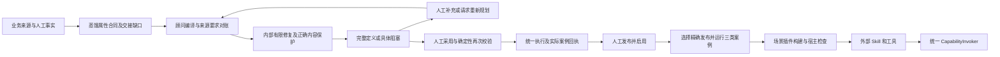
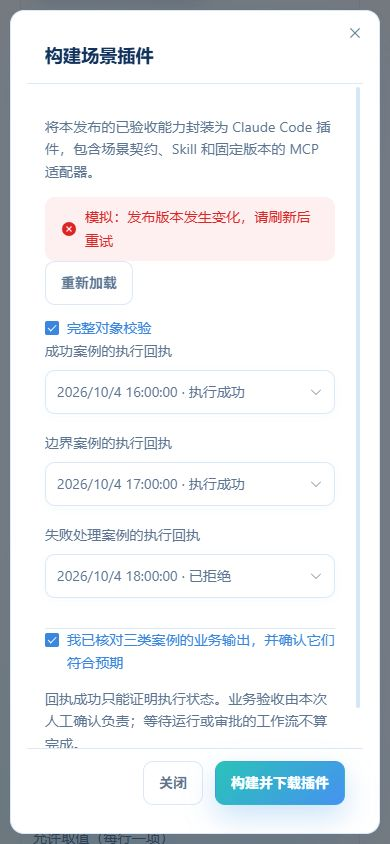

# 场景建设闭环：实施契约与验收账本

日期：2026-10-04。依据本次用户已批准的整体实现目标；历史诊断只作复现线索，完成状态以当前代码和实际验收为准。

## 方法与交付标准

以业务要求为单位固定范围；生成是内部步骤，交付是经过校验的完整成果。蒸馏、顾问、验证和交付共享要求与案例。探索可保存，正式采用/发布仍人工决定；未知不伪造，失败不冒充成功。首轮 70% 是需真实模型测量的质量指标；标为可采用的交付必须全部满足其合同。

## 需求账本

| ID | 目标 | 非目标 | 可观察验收 | 影响范围 | 保持不变 | 测试证据 |
| --- | --- | --- | --- | --- | --- | --- |
| I1 | 蒸馏交付结构化建设要求且不丢已有内容 | 强迫早期探索完整；默默删除 | typed 属性及约束可保存/交接；遗漏保留，删改明确；交接质量可见 | distillation DTO/proposal/tools/worker/artifacts + 前端 | 原证据/人工决定/授权/revision | 属性合同与稀疏更新回归通过；检查范围为本体交接 |
| I2 | 正确定位单元错误并检查需求遗漏/语义 | 信任模型自报可用；按名称猜事实 | 9 正确 + 1 错误只影响真实依赖；缺对象/类型/约束被识别 | compiler 适配 + 独立校验模块/候选 | 门禁 fail closed、旧来源兼容 | 9/10、遗漏第十项、真实依赖、原来源冲突、分片/错误资料回归通过 |
| I3 | 内部修复保护正确内容、有明确进展/退出 | 重复整批失败；放宽校验 | 嵌套字段/要求不退步；补充后重新校验；无进展给出下一步 | repair/独立进展与交付服务 | 调用预算/lease/异常/人工采用 | 属性丢失/约束退步被拒绝；有限修复/无进展回归通过 |
| I4 | 完整成果、阻塞及重新规划形成用户闭环 | 要求专家逐表单修半成品 | 服务端结果分类；用户可给补充/请求改方案；原条件校验后关闭 | assistant API/DTO/持久 JSON/独立组件 | 租户/ACL/CAS、旧发布身份 | question/revision 校验、界面提交与草稿保留通过；自动替代方案比较尚未实现 |
| I5 | 运行与验证采用同一实际契约 | 为某协议新增内核 | 必要执行组合/缺实现显式化；业务案例验证 | workflow/provider/readiness/verification | 统一 Invoker、数据边界、副作用确认 | 精确发布选择、发现/就绪/调用同版本、持久重试与实际工作流完成门禁；运行组合桥仍未完成 |
| I6 | 对外交付可安装的场景包/插件 | 仅换协议宣称闭环；任意动态代码 | 精确人工发布身份、无密钥工件、安装配置与调用测试 | release/package router/service/schema + UI/宿主适配 | 人工发布/场景凭据范围/统一运行 | 默认 Claude Code；确定性 ZIP、宿主校验、实际 stdio 握手及真实接口格式回归通过；真实外部调用待验收 |

影响图：用户目标 → 蒸馏 UI/工具 → 结构化来源 → 顾问编译/单元验收 → 内部修复/阻塞/重规划 → 候选采用 → 统一执行与真实验证 → 人工发布 → 包构建/外部客户端 → 回执。新子领域拆成独立模块，巨型入口只薄编排；数据持久契约变化读取实际 Alembic head 后新增迁移。既有诊断文件保留，不覆盖用户改动。

## 实施记录

开始时 tracked 工作区无改动；七个既有未跟踪诊断/报告文件属于本会话，保留。默认 Python 不受支持，执行使用现有 Python 3.12 环境及仓库忽略的 pytest 8.x 测试依赖；不读取 backend/.env。真实服务通过受控 Settings 消费配置。

本轮完成下述可复现的第一阶段。历史诊断及其源码哈希是修改前基线，不用其旧 242/229/56 项结果冒充当前验收。

补充影响图：发现验证中心缺少精确发布选择，新增 I5/I6 必要消费者为 `AgentChat → 独立发布选择组件 → Agent API/typed request → 既有 release-aware runtime/readiness → 原统一调用与持久 Turn`。沿用后端已有 release_id 调用能力，补 UI、契约发现及就绪检查的同版本一致性。旧发布不受当前草稿损坏影响；指定不可用发布不回退草稿；切换时取消读取并排除迟到响应，持久重试保留原 release。新增 6 个后端和 4 个前端回归均通过；组件浏览器验证加载失败/重试、停用、运行锁定和返回当前定义。历史默认当前定义不变。

## 病因与治疗对应

用户要求是“把有依据的完整成果交付出来，并明确关闭剩余阻塞”。现状的根本偏差是把生成资源、段落覆盖、定义可采用、运行就绪、业务完成混成了一种进展。

| 已复现病因 | 本轮处理 | 能证明什么 |
| --- | --- | --- |
| 稀疏 AI 更新会使已有属性/身份等内容消失 | 递归保留遗漏内容；显式 typed 属性合同；探索/建设交付区分 | 已知要求不会因省略消失；不完整本体不能被建设交付工具报为完成 |
| 同段资料引用使一个对象的生成错误阻塞其他正确对象 | 服务端单元归属与传递依赖传播 | 9 正确 + 1 错误保留 9 个可采用对象；依赖错误对象的关系仍阻塞；真实来源冲突仍影响全部消费者 |
| 有名有主键就能过关，遗漏原来源属性/对象或约束未被识别 | 属性语义对账、完整清单覆盖、持久 source_payload 要求再次晋级校验 | 少生成一个对象不会获得完整交付；手改候选不能抹去原要求 |
| 修复删嵌套字段降低错误数，人工问题又按段落合并丢失 | 正确合同保留、最多两次修复、明确停止原因、区分独立业务问题 | 内部修复不能删正确内容；同一段落的两个不同问题都保留 |
| 顾问自己漏填引用，却让专家重讲已有业务 | 依据服务端来源上下文标记修复责任 | 已有来源下的漏引用属于顾问修复；真正业务未知仍要求补充，不伪造依据 |
| 验收把工作流入队当成功，外部客户端只拿裸协议 | 检查实际 WorkflowRun；人工核对三类案例后构建插件 | 已入队/待审批不能证明业务完成；插件提供方法、工具与精确发布身份 |
| 插件需要精确发布回执，但验证 UI 只能选当前定义；发布调用的就绪检查又读草稿 | 补发布选择，发现/就绪/调用同一版本，失败重试保留原版本 | 可在产品中生成所选发布验收证据；已发布内容不被新草稿损坏影响 |

“候选”继续是治理身份，表示等待审阅采用；内容是否完整由服务端单独判定。所有 AI 输出仍经过同一治理门禁，没有通过更名为“正式”来提高完整率。

## 已实现的纵向链路



蒸馏新增属性类型、必填、身份、约束、枚举与依据编辑；建设交付模式拒绝不完整的本体交接，探索仍能保存。该完整性检查仅覆盖本体交接、目标与未决项，不能证明函数、规则、Action、Workflow 已经实现。

顾问结果展示可采用定义、阻塞、缺实现和未覆盖要求。补充携带服务端问题 ID、proposal ID 和 expected revision，重查归属与当前问题后才入持久任务。回答仅是待核对依据；原校验与候选晋级仍裁决是否关闭。重新规划可以提出合并/绕过/替代及业务要求差异，但目前是有门禁的生成请求，尚无完整的机器可比替代方案合同及自动切换机制。需求改变仍需修订蒸馏交接并人工审阅。

首个插件宿主采用 Claude Code；这是用户未指定宿主时的实施假设，并未宣称跨所有宿主可原样安装。插件包含 `.claude-plugin/plugin.json`、Skill、场景 manifest、固定受信 MCP 客户端、依赖清单、README 和校验和；不携带密钥或运行输入。版本化场景身份与 Definition hash 固定，调用仍在平台执行；停用、无权、陈旧、确认、幂等及回执继续由统一内核裁决。参考：[Claude Code 插件规范](https://code.claude.com/docs/en/plugins-reference)。

插件和 MCP/REST 是不同层：插件负责封装与安装体验，协议负责运行调用。本轮没有删除 REST，没有复制执行内核，也没有把租户/LLM 代码变成生产动态执行。

## 用户操作与可复现命令

1. 蒸馏阶段核对对象的 typed 属性合同与证据，查看本体交接缺口；先调查已授权资料，再询问缺失事实。
2. 顾问建设后在“本轮建设结果”中核对完整成果与具体问题；直接补充事实或提出重新规划原因，重新通过校验后采用。
3. 用验证中心的“当前定义”运行本次输入，核对业务输出并完善建设内容，然后人工创建并启用精确发布。
4. 在验证会话的“本次验证使用”选择该发布。对要交付的每项能力重新运行并核对不同的成功、边界和失败处理案例；不能拿草稿回执或一条回执充三类案例。返回发布列表点击“构建插件”，选择能力及本发布、本人可读的案例，明确人工验收后下载。
5. 解压插件，使用 Python 3.12 安装包内依赖；单独配置 HTTPS MCP 地址和场景专属凭据，再通过 Claude Code 加载。凭据必须由当前使用者合法获得，不能复制专家个人凭据到包中。已封装版本的运行输入每次显式提供。

包构建接口：`GET /api/scenario-releases/{release_id}/plugin-evidence`；`POST /api/scenario-releases/{release_id}/plugin`。Cookie 主体及工作区权限沿用现有认证边界；构建不会启用或发布场景。只接收封闭 DTO 与预期 revision，服务端再次读取本人、当前场景和精确发布的回执。构建后重读发布状态，遇并发停用或版本变化拒绝。

在受支持的 Python 3.12 + 项目依赖环境中，可独立验证模板格式和真正的本机 MCP 协议握手，不需要业务数据库或密钥：

```powershell
$env:PYTHONPATH=(Resolve-Path .\backend).Path
python .\backend\scripts\verify_scenario_plugin.py --output .\.tmp-plugin-verification-new
claude plugin validate .\.tmp-plugin-verification-new\scenario-synthetic
```

输出目录必须是新目录；脚本不覆盖旧证据。它生成明确标为合成的格式验收包，验证可复现性和五个实际 stdio 工具，不调用业务能力。真实插件使用包内 README：`claude --plugin-dir ./<解压目录>`，环境配置 `SCENARIO_MCP_URL` 与 `SCENARIO_API_KEY`；API Key 的能力范围、场景归属和成员身份仍由服务端验证。

## 本轮实际验收证据

| 验证 | 实际结果 | 证据边界 |
| --- | --- | --- |
| Python 3.12 后端全量 | **272 passed**，3.82 秒 | pytest 8.x；没有启用真实 PG 集成测试开关；有一个 MCP/Pydantic 上游 lifespan 注解警告 |
| 前端 `npm --prefix ./frontend test` | **235 passed**，801.1 毫秒 | 包括案例校验、发布目标竞态/失败重试；不是完整浏览器 E2E |
| 前端 `npm --prefix ./frontend run build` | **通过** | vue-tsc + Vite；有既有大 chunk 与上游注释警告，未放宽门禁 |
| 只读实际部署检查 | **通过** | 当前 PostgreSQL schema、运行角色最小权限、MinIO、Redis；不写业务数据，不等同并发/业务验收 |
| 新生成 ZIP 可复现及真正 stdio initialize/list_tools | **通过** | 工件 SHA-256 `d8150f9ef115270fd1f2232e2a5376e557bdf1adc6b16ceb9e8380d69f4e2b8b`；五工具实际注册，未使用凭据/调用业务 |
| Claude Code 2.1.208 `plugin validate` | **Validation passed** | 实际校验本轮生成的 synthetic manifest，不等同安装后的业务执行 |
| 真实接口格式回归 | **通过** | 直接使用平台 MCP `list_capabilities` 的真实函数封装，发现并修复目录 envelope；确认项按 receipt.status 判断 pending |
| 浏览器组件 smoke | **通过** | 实际 Vue 组件 + 明确合成回执、无后端；补充/重规划/属性添加/案例拒绝/模拟版本冲突保留草稿；发布列表失败后重试、停用不可选、运行锁定、返回当前定义 |
| 窄屏组件检查 | **通过** | 390 × 844，页面无横向溢出，dialog 与 footer 位于 viewport；修复验收文字截断、使用中文执行状态；截图见下 |
| `git diff --check` | **通过** | 仅现有换行提示；未改依赖 lockfile、数据库 migration、环境密钥或用户业务数据 |

先复现旧错误再修复：分片/错误属性合同/同段不同问题先为 3 failed；实际 MCP envelope/确认形状先为 2 failed；顾问漏引用责任先为 1 failed；发布验证的草稿污染/不可用发布/入口漏传版本先为 4 failed。修复后及全量回归均通过。9/10 是确定性合成对照，证明错误隔离及需求遗漏门禁，**不能证明某个真实模型已经达到 90%**。

后端实际命令使用现有 `D:/anaconda3/envs/ontology_platform_env/python.exe`，其环境为 Python 3.12；测试依赖从忽略的 `.tmp-scenario-audit-testdeps` 加入 `PYTHONPATH`，`PYTEST_DISABLE_PLUGIN_AUTOLOAD=1`，`PYTHONDONTWRITEBYTECODE=1`。最新全量命令为 `python -m pytest backend/tests -q -p no:cacheprovider --basetemp=E:/实验室/ontology_business/.tmp-scenario-fulltest-20261004-release-final`。复跑应换全新临时目录。省略 basetemp 时本机默认 Temp 权限使 5 个 fixture 无法建立，改用新工作区目录后 272 项通过。Node 24.6、npm 11.5.1。Vite/test 与 Windows stdio 因子进程权限限制在自动审批通过后运行；未更改系统安全设置。




## 真实质量指标与工厂完成定义

首轮通过率的分母是**预先确认应当建设的业务单元清单**，不是模型实际生成数量。十个要求少生成三个仍按十个计；对象与其全部属性一起计一个单元，不能用大量容易通过的属性抬高比例。

| 指标 | 方法与退出条件 |
| --- | --- |
| 首轮完整率 ≥ 70% | 首次生成、内部修复前，按固定清单计算通过确定性合同和专家语义核对的完整单元比例 |
| 对外交付完整性 | 所有声称“完整”的单元必须通过其原要求、完整依赖、实际执行和所声明案例；其余只交具体缺口与关闭条件 |
| 需求覆盖 | 必要目标、对象、属性、关系、能力、端口、产物全部对账；不得删要求、乱标 context 或自动降低约束 |
| 修复收益 | 记录每轮未关闭阻塞、接受改进、正确单元是否回退、调用预算与成本；本轮最多两次，停止原因可见 |
| 人工负担 | 每项问题必须指明缺事实/缺依据及关闭条件；类型、漏属性、漏引用等生成错误由内部处理 |
| 正式发布可执行性 | 成功、边界、失败/拒绝及必要审批/恢复案例消费精确发布和统一 Invoker；版本或输入改变后重做适用验证 |
| 插件可用性 | 宿主加载、工具发现、当前输入、预演确认、异步完成、产物取回、停用/升级行为真实验收 |

需要冻结跨简单、关系复杂、数据型和副作用型的真实场景集，保存 gold 要求、预期输出、模型/提示版本、资料内容身份与预算，至少重复运行并报告分布。缺资料的测试要验证系统明确阻塞而非编造字段；不可行方案要验证替代与取舍而非反复原样生成。这些真实模型与业务场景指标本轮**尚未测量**。

## 未完成的必要工程与下一阶段验收

本轮是第一阶段代码闭环，整个场景定制工厂尚未完成。以下不是换一个插件格式就能消除的缺口：

| 优先级 | 仍需实现 | 验收约束 |
| --- | --- | --- |
| P0 | 受治理函数/能力工作流组合与 typed 输入/输出绑定 | 编辑、编译、依赖闭包、Release 冻结、readiness、统一 Invoker 和 worker 全链一致；不可用 LLM 算术或 HTTP 自调用替代确定性函数 |
| P0 | 受管 RuntimeDataContext 在组合执行中的传播 | 固定 DatasetVersion，父子端口显式绑定、原 principal/Release/幂等 lineage；A/B 数据不改变 Definition；零数据反例与跨租户拒绝 |
| P0 | 未实现合同转可信 Coding 工程任务 | 先给闭合 I/O 合同、gold 案例和执行计划，在隔离构建环境生成代码候选；评审测试后注册精确受信 Provider；生产禁止执行任意租户/LLM 代码 |
| P1 | Provider 作者合同及正式可交付执行器矩阵 | 通用编译器调用版本化作者接口；规划阶段识别“正式可交付/仅验证/缺桥”，不能到发布时才发现路线无效 |
| P1 | 可执行业务断言、验收报告及替代方案比较合同 | 需求 ID → 输入 → 预期结构/值/状态 → 回执 → 产物；要求改变有机器可比差异和人工批准；目前人工三类回执勾选不能取代这些断言 |
| P1 | 真实外部场景验收及产物/上传体验 | 场景专属凭据、HTTPS 实际调用、审批/幂等/停用、受管附件及业务文件真实交付；本轮客户端支持已有受管引用，尚无完整宿主文件上传桥 |
| P2 | 多宿主、签名与发布分发治理 | 宿主适配分别验证，包 hash/校验和是内容身份，**不是可信签名或安装安全证明**；当前只支持 Claude Code 在线执行 |

本轮没有新增 ORM 字段、迁移或权限模型，新增治理元数据保存在现有版本化 JSON 中，因此 migration/DDL/concurrency 改动验收 N/A。未运行完整登录/路由/真实后端浏览器流程、专用数据库并发/迁移往返、新插件真实凭据调用、真实 LLM 质量基准；不能用当前绿灯代替它们。新控制面入口仍需在专用验收环境覆盖无权、并发 revision、发布停用与真实案例。
